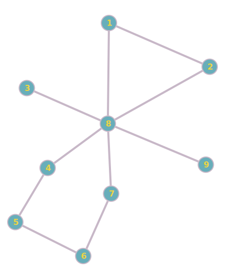

# Graph Application

This project demonstrates graph traversal using BFS (Breadth\-First Search), DFS (Depth\-First Search), and the
Bron\-Kerbosch algorithm for finding maximal independent sets.

## Features

1. **BFS**:
    - Uses a queue to traverse and visit nodes level by level.
2. **DFS**:
    - Explores nodes by going as deep as possible, then backtracking.
3. **Bron\-Kerbosch**:
    - Finds a maximal independent set in an undirected graph through a recursive algorithm.

## Build and Run

1. **Compile**:
   ```bash
   ./gradlew clean build
   ```

   Terminal output may show something like:

   ```
   BUILD SUCCESSFUL in ...
   3 actionable tasks: 3 executed
   ```

2. **Run**:
   ```bash
   ./gradlew run --args="<filePath> <searchMethod> <startNodeId>"
   ```
    - **filePath**: The path to the text file containing the graph data.
    - **searchMethod**: `BFS`, `DFS`, or `BK`. If using `BK`, a start node is optional \(-1 by default\).
    - **startNodeId**: Required when the method is BFS or DFS.

### Example

The graph data is provided in the `graph.txt` represents the following graph:



#### Running BFS

```bash
./gradlew run --args="graph.txt BFS 1"
```

*Output:*

```
1 -> 2 -> 3 -> 4 -> 5 -> 6 -> 7 -> 8 -> 9 -> 10 -> 11 -> 12 -> 13 -> 14 -> 15 -> 16 -> 17 -> 18 -> 19 -> 20 -> 21 -> 22
```

#### Running DFS

You can use:

```bash
./gradlew run --args="graph.txt DFS 1"
```

or:

```bash
./gradlew run --args="graph.txt 1"
```

*Output:*

```
1 -> 2 -> 5 -> 11 -> 12 -> 6 -> 13 -> 14 -> 3 -> 7 -> 15 -> 16 -> 8 -> 17 -> 18 -> 4 -> 9 -> 19 -> 20 -> 10 -> 21 -> 22
```

#### Running Bron\-Kerbosch

```bash
./gradlew run --args="graph.txt BK"
```

*Output:*

```
Largest independent set of size (15) and elements: 2, 3, 4, 11, 12, 13, 14, 15, 16, 17, 18, 19, 20, 21, 22
```

## License

This project is licensed under the MIT License. See the [LICENSE](LICENSE) file for details.
