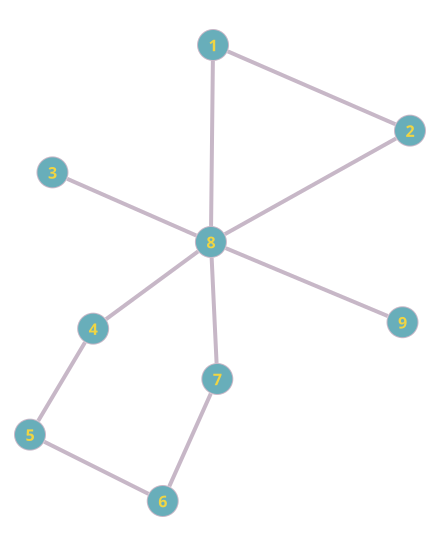

# Graph Application

This project demonstrates graph traversal using BFS (Breadth-First Search), DFS (Depth-First Search), and the
Bron-Kerbosch algorithm for finding maximal independent sets.

## Features

1. **BFS**:
    - Uses a queue to traverse and visit nodes level by level.
2. **DFS**:
    - Explores nodes by going as deep as possible, then backtracking.
3. **Bron-Kerbosch**:
    - Finds a maximal independent set in an undirected graph through a recursive algorithm.
4. **Minimum Spanning Tree (MST) using Prim's algorithm**:
    - Constructs a minimum spanning tree from a weighted graph.
5. **DSatur Graph Coloring**:
    - Colors a graph using the DSatur (Degree of Saturation) heuristic algorithm.

## Build and Run

This project is written in C and uses CMake for building.

### Prerequisites

- CMake 3.10 or higher
- A C compiler (GCC, Clang, or MSVC)

### Building

1. **Configure and compile**:
   ```bash
   mkdir -p build
   cd build
   cmake ..
   make
   ```

   This creates the `graph-app` executable in the `build` directory.

2. **Run**:
   ```bash
   ./build/graph-app <filePath> <graphOperation> [startNodeId]
   ```
    - **filePath**: The path to the text file containing the graph data.
    - **graphOperation**: `BFS`, `DFS`, `BK`, `PRIM`, or `DSATUR`.
    - **startNodeId**: Required when the operation is BFS or DFS.

### Example

The graph data is provided in the `graph.txt` represents the following graph:



#### Running BFS

```bash
./build/graph-app graph.txt BFS 1
```

*Output:*

```
1 -> 7 -> 5 -> 4 -> 6 -> 2 -> 3
```

#### Running DFS

```bash
./build/graph-app graph.txt DFS 1
```

*Output:*

```
1 -> 7 -> 6 -> 4 -> 3 -> 2 -> 5
```

#### Running Bron-Kerbosch

```bash
./build/graph-app graph.txt BK
```

*Output:*

```
All maximum independent sets (7):
[6, 5];
[6, 2];
[4, 5];
[4, 7];
[5, 3];
[7, 3];
[1, 2, 3]
```

#### Running Prim's Algorithm

```bash
./build/graph-app graph.txt PRIM
```

*Output:*

```
Minimum Spanning Tree (Prim's Algorithm):
Edges:
(1 - 6, w:3)
(6 - 7, w:9)
(7 - 2, w:5)
(2 - 5, w:10)
(6 - 4, w:20)
(4 - 3, w:18)
Total Weight: 65
```

#### Running DSatur Graph Coloring

```bash
./build/graph-app graph.txt DSATUR
```

*Output:*

```
Graph Coloring Result (DSatur Algorithm):
Node 1: Color 1
Node 2: Color 1
Node 3: Color 1
Node 4: Color 2
Node 5: Color 3
Node 6: Color 3
Node 7: Color 2

Total colors used: 3
```

## Graph File Format

The graph file should contain edges in the format:
```
node1,node2[,weight]
```

Where:
- `node1` and `node2` are integer node IDs
- `weight` is an optional integer weight (defaults to 1)
- Lines starting with `//` are treated as comments

Example:
```
1,6,3
1,4,30
2,5,10
```

## License

This project is licensed under the MIT License. See the [LICENSE](LICENSE) file for details.
