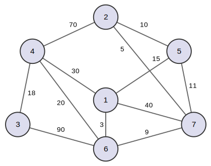

# Graph Application

This project demonstrates graph traversal using BFS (Breadth\-First Search), DFS (Depth\-First Search), and the
Bron\-Kerbosch algorithm for finding maximal independent sets.

## Features

1. **BFS**:
    - Uses a queue to traverse and visit nodes level by level.
2. **DFS**:
    - Explores nodes by going as deep as possible, then backtracking.
3. **Bron\-Kerbosch**:
    - Finds a maximal independent set in an undirected graph through a recursive algorithm.
4. **Minimum Spanning Tree (MST) using Prim's algorithm**:
    - Constructs a minimum spanning tree from a weighted graph.

## Build and Run

1. **Compile**:
   ```bash
   ./gradlew clean build
   ```

   Terminal output may show something like:

   ```
   BUILD SUCCESSFUL in ...
   3 actionable tasks: 3 executed
   ```

2. **Run**:
   ```bash
   ./gradlew run --args="<filePath> <graphOperation> <startNodeId>"
   ```
    - **filePath**: The path to the text file containing the graph data.
    - **graphOperation**: `BFS`, `DFS`, or `BK`. If using `BK`, a start node is optional \(-1 by default\).
    - **startNodeId**: Required when the method is BFS or DFS.

### Example

The graph data is provided in the `graph.txt` represents the following graph:



#### Running BFS

```bash
./gradlew run --args="graph.txt BFS 1"
```

*Output:*

```
1 -> 6 -> 4 -> 5 -> 7 -> 3 -> 2
```

#### Running DFS

You can use:

```bash
./gradlew run --args="graph.txt DFS 1"
```

or:

```bash
./gradlew run --args="graph.txt 1"
```

*Output:*

```
1 -> 6 -> 3 -> 4 -> 2 -> 5 -> 7
```

#### Running Bron\-Kerbosch

```bash
./gradlew run --args="graph.txt BK"
```

*Output:*

```
All maximum independent sets (7):
[2, 6];
[3, 5];
[3, 7];
[4, 5];
[4, 7];
[5, 6];
[1, 2, 3]
```

#### Running Prim's Algorithm

```bash
./gradlew run --args="graph.txt PRIM"
```

*Output:*

```
Minimum Spanning Tree (Prim's Algorithm):
Edges:
(1 - 6, w:3)
(6 - 7, w:9)
(7 - 2, w:5)
(2 - 5, w:10)
(6 - 4, w:20)
(4 - 3, w:18)
Total Weight: 65
```

## License

This project is licensed under the MIT License. See the [LICENSE](LICENSE) file for details.
